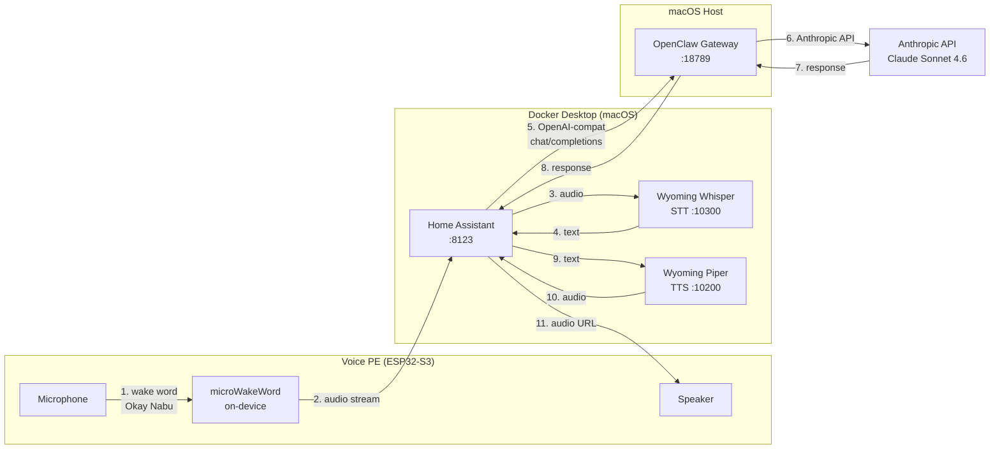
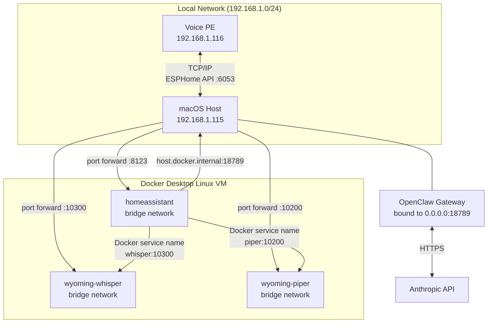
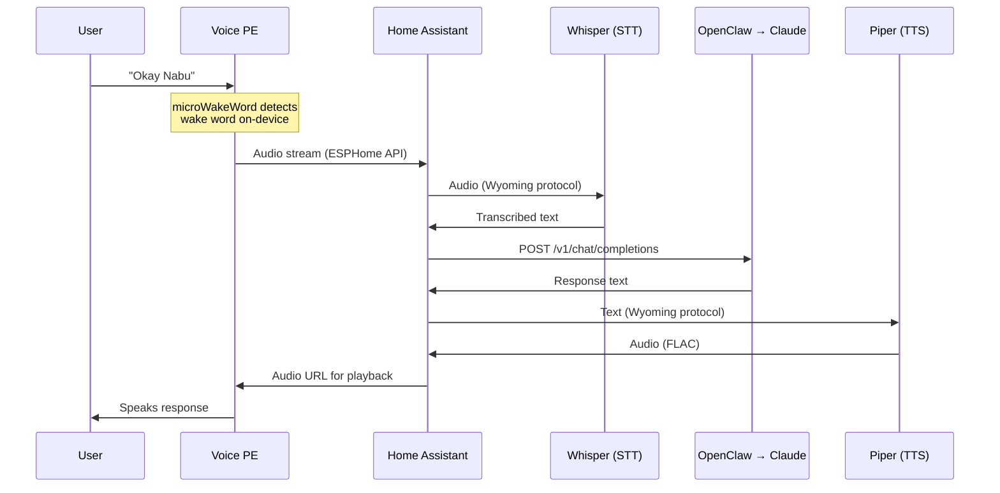
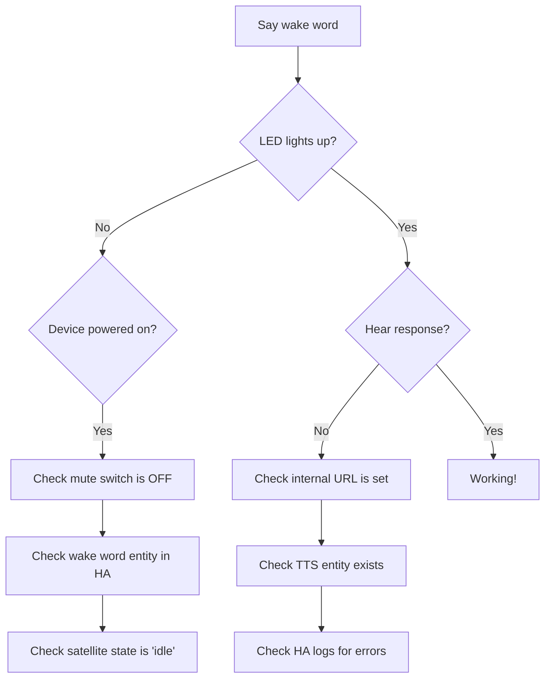

# Voice Stack — HA Voice PE + OpenClaw + Claude

A complete voice assistant stack running on macOS (Docker Desktop), connecting a **Home Assistant Voice Preview Edition** device to **Claude** (via Anthropic) through **OpenClaw** as an OpenAI-compatible gateway.

## Architecture



## Network topology



## Components

| Component | Image / Binary | Port | Role |
|---|---|---|---|
| Home Assistant | `ghcr.io/home-assistant/home-assistant:stable` | 8123 | Orchestrator, pipeline manager |
| Wyoming Whisper | `rhasspy/wyoming-whisper` | 10300 | Speech-to-text (STT) |
| Wyoming Piper | `rhasspy/wyoming-piper` | 10200 | Text-to-speech (TTS) |
| OpenClaw Gateway | Native macOS binary | 18789 | OpenAI-compatible proxy → Anthropic Claude |
| Voice PE | ESPHome firmware (ESP32-S3) | 6053 | Microphone, speaker, on-device wake word |

## Prerequisites

- **macOS** with Docker Desktop installed and running
- **OpenClaw** installed and authenticated with Anthropic (`openclaw onboard`)
- **Home Assistant Voice Preview Edition** device
- **2.4 GHz WiFi** network (Voice PE does not support 5 GHz)
- **HA Companion app** on your phone (for Bluetooth onboarding of the Voice PE)

## Setup

### Step 1 — Configure OpenClaw gateway

Edit `~/.openclaw/openclaw.json` and make two changes in the `gateway` section:

**A. Bind to LAN** (required so Docker containers can reach it):

```json
"bind": "lan"
```

> This changes the bind address from `127.0.0.1` to `0.0.0.0`. Token auth protects it.

**B. Enable the Chat Completions endpoint** (disabled by default):

```json
"http": {
  "endpoints": {
    "chatCompletions": {
      "enabled": true
    }
  }
}
```

The full `gateway` block should look like:

```json
"gateway": {
  "port": 18789,
  "mode": "local",
  "bind": "lan",
  "auth": {
    "mode": "token",
    "token": "<your-token>"
  },
  "http": {
    "endpoints": {
      "chatCompletions": {
        "enabled": true
      }
    }
  }
}
```

Restart the gateway:

```bash
kill $(pgrep -f openclaw-gateway)
# It auto-restarts via its service manager
```

Verify it's bound to all interfaces:

```bash
lsof -i :18789 -P -n
# Should show *:18789, not 127.0.0.1:18789
```

### Step 2 — Start the Docker stack

```bash
cd ~/voice-stack
docker compose up -d
```

Wait for all 3 containers to be healthy:

```bash
docker ps --format "table {{.Names}}\t{{.Status}}\t{{.Ports}}"
```

> First run downloads the Whisper model (~1.5 GB) and Piper voice (~100 MB). This takes a few minutes.

### Step 3 — Complete HA setup wizard

Open **http://localhost:8123** and complete the onboarding wizard (create account, set location, etc.).

### Step 4 — Set HA internal URL

This is **critical** — without this, the Voice PE cannot fetch TTS audio files from HA.

Go to **Settings → System → Network** → set **Local Network** URL to:

```
http://<your-mac-ip>:8123
```

Or edit directly:

```bash
docker exec -i homeassistant python3 << 'EOF'
import json
with open("/config/.storage/core.config", "r") as f:
    data = json.load(f)
data["data"]["internal_url"] = "http://<your-mac-ip>:8123"
with open("/config/.storage/core.config", "w") as f:
    json.dump(data, f, indent=2)
EOF
```

Then restart HA.

### Step 5 — Onboard the Voice PE

1. Plug the Voice PE into USB-C power — warm white twinkle animation appears
2. Open the **HA Companion app** on your phone (Bluetooth enabled)
3. A pop-up asks to set up ESPHome → tap **OK**
4. Enter **2.4 GHz WiFi credentials**
5. Press the **center button** when prompted
6. Device joins WiFi and appears in HA

> **Why Companion app?** Docker Desktop cannot access the Mac's Bluetooth hardware. The Companion app handles the Bluetooth onboarding, then the Voice PE communicates with HA over TCP/IP.

If the Companion app doesn't discover the device, flash firmware via USB-C using the [web installer](https://esphome.github.io/home-assistant-voice-pe/).

### Step 6 — Add ESPHome integration

**Settings → Devices & Services → Add Integration → ESPHome**

Enter the Voice PE's IP address (find it with `arp -a | grep voice`), port `6053`.

### Step 7 — Add Wyoming integrations

**Settings → Devices & Services → Add Integration → Wyoming Protocol**

Add twice:

| Service | Host | Port |
|---|---|---|
| Whisper (STT) | `whisper` | `10300` |
| Piper (TTS) | `piper` | `10200` |

> Use Docker service names as hostnames — HA resolves them via the compose network.

### Step 8 — Install HACS

HACS cannot be installed via the Add-on Store (that doesn't exist on Docker installs). Install via CLI:

```bash
docker exec -it homeassistant bash
wget -O - https://get.hacs.xyz | bash -
exit
```

Restart HA:

```bash
docker compose restart homeassistant
```

Then in HA: **Settings → Devices & Services → Add Integration → HACS** → complete the GitHub OAuth flow.

### Step 9 — Install Extended OpenAI Conversation

**HACS → Integrations → search "Extended OpenAI Conversation" → Download**

Or install manually:

```bash
docker exec -i homeassistant bash -c "
cd /tmp
wget -q https://github.com/jekalmin/extended_openai_conversation/archive/refs/tags/2.0.0-beta2.zip -O eoc.zip
unzip -o eoc.zip
cp -r extended_openai_conversation-2.0.0-beta2/custom_components/extended_openai_conversation /config/custom_components/
rm -rf eoc.zip extended_openai_conversation-2.0.0-beta2
"
```

**Fix the dependency conflict** (HA 2026.x ships openai 2.15+ but the integration pins ~=2.8.0):

```bash
docker exec -i homeassistant sed -i 's/"openai~=2.8.0"/"openai>=2.8.0"/' \
  /config/custom_components/extended_openai_conversation/manifest.json
```

**Patch the ChatLog integration** (required for TTS to stream to the Voice PE on HA 2026.x):

The Extended OpenAI Conversation integration doesn't write to HA's ChatLog API, which the assist pipeline needs to trigger TTS streaming to satellite devices. Apply this patch:

```bash
docker exec -i homeassistant python3 << 'PATCH'
with open("/config/custom_components/extended_openai_conversation/conversation.py", "r") as f:
    content = f.read()

old = """        intent_response = intent.IntentResponse(language=user_input.language)
        intent_response.async_set_speech(query_response.message.content)"""

new = """        intent_response = intent.IntentResponse(language=user_input.language)
        intent_response.async_set_speech(query_response.message.content)

        # Add assistant message to chat log for pipeline TTS streaming
        try:
            chat_log.async_add_assistant_content_without_tools(
                conversation.AssistantContent(
                    agent_id=self.entity_id,
                    content=query_response.message.content or "",
                )
            )
        except Exception:
            pass"""

content = content.replace(old, new)

with open("/config/custom_components/extended_openai_conversation/conversation.py", "w") as f:
    f.write(content)
print("Patched!")
PATCH
```

Restart HA after all changes.

### Step 10 — Configure Extended OpenAI Conversation

**Settings → Devices & Services → Add Integration → Extended OpenAI Conversation**

| Field | Value |
|---|---|
| Name | `Claude via OpenClaw` |
| Base URL | `http://host.docker.internal:18789/v1` |
| API Key | Your OpenClaw gateway token |
| Skip Authentication | `true` |

Then update the model to Claude by editing the config storage:

```bash
docker exec -i homeassistant python3 << 'EOF'
import json
with open("/config/.storage/core.config_entries", "r") as f:
    data = json.load(f)
for entry in data["data"]["entries"]:
    if entry.get("domain") == "extended_openai_conversation":
        for sub in entry.get("subentries", []):
            sub["data"]["chat_model"] = "claude-sonnet-4-6"
            sub["data"]["max_tokens"] = 500
with open("/config/.storage/core.config_entries", "w") as f:
    json.dump(data, f, indent=2)
print("Model set to claude-sonnet-4-6")
EOF
```

Restart HA.

### Step 11 — Create the voice pipeline

**Settings → Voice Assistants → Add Assistant**

| Field | Value |
|---|---|
| Name | `Claude Voice` |
| Speech-to-text | faster-whisper |
| Conversation agent | Extended OpenAI Conversation |
| Text-to-speech | piper |
| Language | English |

Set it as the **preferred pipeline**.

### Step 12 — Assign pipeline to Voice PE

**Settings → Devices → Home Assistant Voice PE → Assistant** → select `preferred` (or `Claude Voice` directly).

## Request flow



## Wake words

The Voice PE supports on-device wake word detection via microWakeWord. Available options:

| Wake word | Setting |
|---|---|
| **Okay Nabu** | Default |
| **Hey Jarvis** | Change via HA entity |
| **Hey Mycroft** | Change via HA entity |

Change via: **Settings → Devices → Voice PE → Wake word entity**

Or via API:

```bash
curl -X POST http://localhost:8123/api/services/select/select_option \
  -H "Authorization: Bearer <token>" \
  -H "Content-Type: application/json" \
  -d '{"entity_id":"select.home_assistant_voice_0ac45d_wake_word","option":"Hey Jarvis"}'
```

## Changing language

The stack defaults to **English**. To switch to another language (e.g. French):

1. Update `docker-compose.yml`:
   ```yaml
   whisper:
     command: --model medium-int8 --language fr
   piper:
     command: --voice fr_FR-siwis-medium
   ```

2. Recreate the containers:
   ```bash
   docker compose up -d whisper piper
   ```

3. Update the voice pipeline in HA to match (`fr` for STT, `fr_FR` for TTS).

Available Piper voices: [rhasspy/piper](https://github.com/rhasspy/piper?tab=readme-ov-file#voices)

## Troubleshooting

### Voice PE doesn't respond to wake word



### No audio from speaker

The most common cause is **HA's internal URL not being set**. The Voice PE fetches TTS audio via HTTP from HA — if HA doesn't know its own URL, the device can't fetch the audio.

**Fix:** Settings → System → Network → set Local Network URL to `http://<mac-ip>:8123`

### STT returns garbage text

Whisper is configured for a specific language. If you speak a different language than what Whisper expects, it will produce nonsense. Check the `--language` flag in `docker-compose.yml`.

### "stt-provider-missing" error

The pipeline references an STT entity that no longer exists (e.g. after removing a duplicate Wyoming integration). Check which `stt.*` entities exist and update the pipeline to match.

### Extended OpenAI Conversation won't load

Check `docker logs homeassistant` for `RequirementsNotFound` errors. The `openai` package version pin may conflict with what HA ships. Fix by changing `~=2.8.0` to `>=2.8.0` in the manifest:

```bash
docker exec -i homeassistant sed -i 's/"openai~=2.8.0"/"openai>=2.8.0"/' \
  /config/custom_components/extended_openai_conversation/manifest.json
```

### Docker containers can't reach OpenClaw

Verify OpenClaw is bound to `0.0.0.0` (not `127.0.0.1`):

```bash
lsof -i :18789 -P -n
# Must show *:18789
```

If bound to loopback, change `"bind": "lan"` in `~/.openclaw/openclaw.json` and restart the gateway.

### Voice PE not discovered

Docker Desktop runs in a Linux VM — mDNS discovery may not work. Add the Voice PE manually by IP in the ESPHome integration. Find its IP:

```bash
arp -a | grep voice
```

## File structure

```
~/voice-stack/
├── docker-compose.yml          # Container definitions
├── ha-config/                  # HA config volume (auto-created)
│   ├── configuration.yaml
│   ├── custom_components/
│   │   ├── extended_openai_conversation/  # Patched integration
│   │   └── hacs/
│   └── .storage/               # HA internal state
├── whisper-data/               # Whisper model cache (auto-created)
├── piper-data/                 # Piper voice cache (auto-created)
└── README.md                   # This file
```

## Gotchas specific to macOS + Docker

| Issue | Why | Fix |
|---|---|---|
| `network_mode: host` doesn't work | Docker Desktop runs containers in a Linux VM | Use bridge mode + port mapping + `host.docker.internal` |
| OpenClaw unreachable from containers | Bound to loopback by default | Set `"bind": "lan"` in openclaw.json |
| No Bluetooth in HA | Docker VM has no access to Mac hardware | Use Companion app for Voice PE onboarding |
| mDNS discovery fails | Bridge network isolates mDNS | Add devices manually by IP |
| Add-on Store missing | Only available on HAOS installs | Install HACS and integrations via CLI |
| Voice PE can't play TTS | HA doesn't know its own URL | Set `internal_url` in Settings → System → Network |
